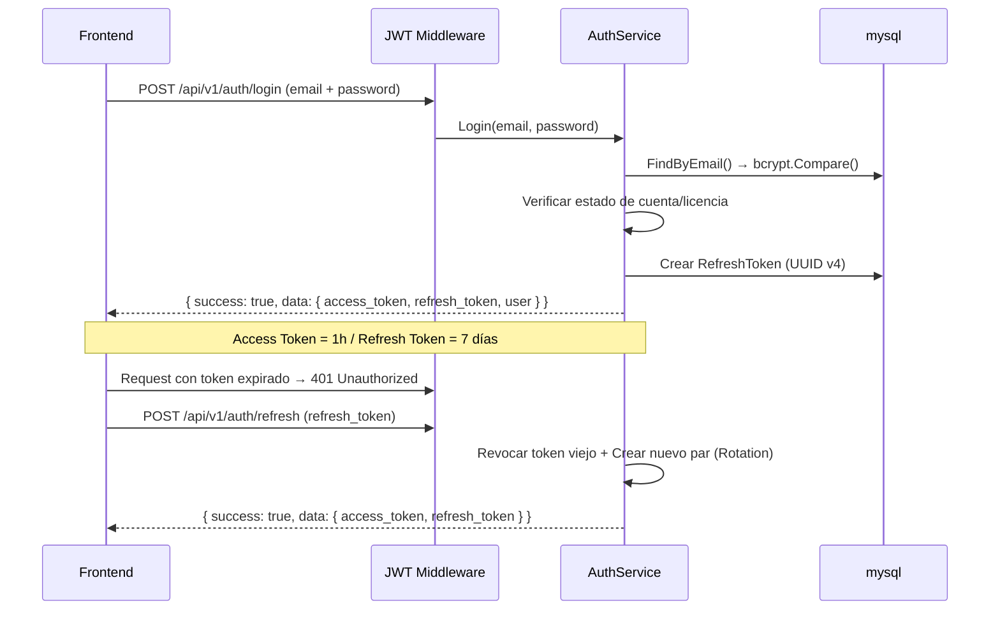

# 🏗️ Blueprint de Arquitectura — Monorepo Fullstack Go + Angular 19 (Nx)

> **Instrucción Crítica para Agentes de IA**: Este documento es la especificación arquitectónica FUNDACIONAL que debes seguir de forma estricta. Representa las decisiones de diseño definitivas. No tomes atajos, no inventes patrones alternativos y sigue las convenciones exactas descritas aquí. Al final del documento encontrarás el "Protocolo de Ejecución" que te indicará cómo debes construir este proyecto paso a paso sin saturar tu contexto.

---

## 1. Stack Tecnológico (OBLIGATORIO)

| Capa | Tecnología | Versión |
|---|---|---|
| **Backend** | Go (Golang) + Fiber v2 | Go 1.22+ |
| **Frontend** | Angular + Nx Monorepo | Angular 19 / Nx 22+ |
| **Base de Datos** | Mysql + GORM (ORM) | Mysql 8.3+ / GORM v1 |
| **Migraciones DB** | `golang-migrate` (Para Producción) | v4+ |
| **Testing Backend** | `testify/mock` | v1.8+ |
| **Arquitectura** | Monorepo — Hexagonal Backend + Nx Feature Libs Frontend | — |
| **Autenticación** | JWT (access + refresh tokens) + bcrypt | — |
| **Encriptación** | AES-256-GCM para datos sensibles en DB | — |
| **Traducciones** | `@ngx-translate/core` + `@ngx-translate/http-loader` | v17+ |
| **Estado Frontend** | Angular Signals (no NgRx, no BehaviorSubjects) | — |
| **Estilos** | TailwindCSS v4 + PostCSS | v4+ |

---

## 2. Estructura del Monorepo (REPLICAR EXACTAMENTE)

```text
proyecto/                                 ← Monorepo raíz
├── backend/
│   ├── .env                              ← Variables de entorno (NUNCA commitear)
│   ├── .env.example                      ← Plantilla de ejemplo (SÍ commitear)
│   ├── cmd/
│   │   └── server/
│   │       └── main.go                   ← Entry point + DI wiring
│   ├── internal/
│   │   ├── core/                         ← DOMINIO PURO (sin dependencias externas)
│   │   │   ├── domain/
│   │   │   │   ├── models.go             ← Modelos GORM principales
│   │   │   │   ├── user.go               ← User + License + RefreshToken
│   │   │   │   ├── config.go             ← Config structs
│   │   │   │   └── crypto.go             ← Utilidades AES-256-GCM
│   │   │   ├── ports/
│   │   │   │   ├── repositories.go       ← Interfaces de repositorios
│   │   │   │   └── services.go           ← Interfaces de servicios
│   │   │   └── services/
│   │   │       ├── [entidad]_service.go  ← Lógica de negocio principal
│   │   │       ├── [entidad]_service_test.go ← Tests unitarios (Testify)
│   │   │       ├── auth_service.go       ← JWT + login/logout/refresh
│   │   │       └── admin_service.go      ← CRUD usuarios/licencias
│   │   └── adapters/                     ← INFRAESTRUCTURA (implementa puertos)
│   │       ├── handler/
│   │       │   ├── auth_handler.go       ← Auth endpoints
│   │       │   ├── admin_handler.go      ← Admin endpoints
│   │       │   └── [modulo]_handler.go   ← Un handler por módulo funcional
│   │       ├── middleware/
│   │       │   └── auth_middleware.go    ← JWT middleware (en su propio archivo)
│   │       └── storage/
│   │           ├── mysql_[entidad]_repository.go  ← Un repo por entidad
│   │           └── ...
│   ├── migrations/                       ← Archivos SQL de migraciones (Up/Down)
│   ├── uploads/                          ← Archivos subidos (en .gitignore)
│   ├── go.mod
│   └── go.sum
│
├── frontend/
│   ├── apps/
│   │   └── [nombre-app]/                 ← App principal Angular 19
│   │       ├── src/
│   │       │   ├── app/
│   │       │   │   ├── app.ts            ← Root component
│   │       │   │   ├── app.routes.ts     ← Rutas con lazy loading
│   │       │   │   └── app.config.ts     ← Providers (router, http, translate)
│   │       │   ├── main.ts
│   │       │   └── styles.css            ← Estilos globales + Tailwind
│   │       └── project.json
│   │
│   ├── libs/
│   │   ├── data-access/                  ← 📦 Servicios, guards, interceptors
│   │   │   └── src/
│   │   │       ├── index.ts              ← Barrel exports (API pública)
│   │   │       └── lib/
│   │   │           ├── [entidad].service.ts
│   │   │           ├── auth.service.ts
│   │   │           ├── environment.ts
│   │   │           └── ...
│   │   ├── i18n/                         ← 📦 Traducciones (es.json, en.json)
│   │   └── features/                     ← 📦 Una lib por pantalla/módulo
│   │       ├── login/
│   │       ├── home-dashboard/
│   │       └── [nombre-feature]/         ← Cada feature = component + html + css
│   ├── nx.json
│   ├── tsconfig.base.json                ← Path aliases (@miapp/*)
│   └── package.json
│
└── .gitignore                            ← Gitignore raíz del monorepo
```

---

## 3. Arquitectura Hexagonal — Backend (OBLIGATORIA)

### 3.1 Reglas Estrictas

1. **`internal/core/` NUNCA importa nada de `internal/adapters/`** — El core solo conoce interfaces (Ports).
2. **Los adapters implementan los puertos** — Esto permite intercambiar la DB o el framework HTTP sin tocar la lógica de negocio.
3. **Toda la inyección de dependencias ocurre en `backend/cmd/server/main.go`** — Es el único sitio que conoce todas las implementaciones concretas.
4. **Un handler por módulo funcional** con método `RegisterRoutes(app *fiber.App)`.

### 3.2 Puertos (Interfaces) — Patrón Obligatorio (`internal/core/ports/`)

```go
// ═══ Puerto de SALIDA (driven) — Repositorio ═══
type EntityRepository interface {
    Create(entity *domain.Entity) error
    FindByID(id uint) (*domain.Entity, error)
    FindByUserID(userID uint) ([]domain.Entity, error)
    Update(entity *domain.Entity) error
    Delete(id uint) error
}

// ═══ Puerto de ENTRADA (driving) — Servicio ═══
type EntityService interface {
    CreateEntity(entity *domain.Entity) error
    GetEntity(id uint) (*domain.Entity, error)
    // ... métodos de negocio ...
}
```

### 3.3 Inyección de Dependencias (`cmd/server/main.go`)

```go
func main() {
    godotenv.Load()

    // 1. Conexión DB (Mysql vía driver MySQL de GORM)
    db, _ := gorm.Open(mysql.Open(os.Getenv("MYSQL_DSN")), &gorm.Config{
        DisableForeignKeyConstraintWhenMigrating: true,
    })
    
    // ⚠️ REGLA IA: Usar AutoMigrate SOLO para desarrollo local/MVP rápido.
    // Para producción, la infraestructura asume el uso de scripts SQL en /migrations.
    db.AutoMigrate(&domain.User{}, &domain.License{}, &domain.RefreshToken{}, &domain.Entity{})

    // 2. Configuración
    encryptionKey := os.Getenv("ENCRYPTION_KEY")

    // 3. Repositorios (adaptadores de salida)
    entityRepo  := storage.NewMysqlDBEntityRepository(db)
    userRepo    := storage.NewMysqlDBUserRepository(db)

    // 4. Servicios (core) — inyección de dependencias vía interfaces
    entityService := services.NewEntityService(entityRepo, userRepo, encryptionKey)
    authService   := services.NewAuthService(userRepo, encryptionKey)

    // 5. Handlers (adaptadores de entrada)
    authHandler   := handler.NewAuthHandler(authService)
    entityHandler := handler.NewEntityHandler(entityService)

    // 6. Fiber + Middleware + Rutas
    app := fiber.New(fiber.Config{AppName: "MiApp v1.0"})
    
    app.Use(cors.New(cors.Config{
        AllowOrigins: os.Getenv("CORS_ORIGINS"), // NUNCA usar "*" en producción
    }))

    // JWT Middleware
    app.Use(middleware.NewJWTMiddleware(authService))

    // Registrar rutas
    authHandler.RegisterRoutes(app)
    entityHandler.RegisterRoutes(app)

    app.Listen(":" + getEnvOrDefault("PORT", "8080"))
}
```

## 4. Modelos de Dominio GORM — Patrones y Reglas

### 4.1 Modelo Principal y Tipos Flexibles

```go
type Entity struct {
    gorm.Model
    UserID uint   `gorm:"index" json:"user_id"`
    Name   string `gorm:"size:255" json:"name"`
    Status string `gorm:"size:50;default:draft" json:"status"`

    // ⚠️ REGLA IA: Usa datatypes.JSON de GORM para almacenar datos cuya estructura 
    // pueda evolucionar sin requerir migraciones de schema constantes.
    Metadata datatypes.JSON `json:"metadata"`
}
```

### 4.2 Modelos con Datos Sensibles (Usuario y Seguridad)

```go
type User struct {
    gorm.Model
    Email          string     `gorm:"uniqueIndex;size:255" json:"email"`
    PasswordHash   string     `gorm:"size:255" json:"-"`  // ⚠️ json:"-" = NUNCA se serializa
    Name           string     `gorm:"size:255" json:"name"`
    Role           string     `gorm:"size:20;default:user" json:"role"` // "admin" | "user"
    IsActive       bool       `gorm:"default:true" json:"is_active"`
    MustChangePass bool       `gorm:"default:true" json:"must_change_password"`
    LastLoginAt    *time.Time `json:"last_login_at"`

    // Datos sensibles encriptados en base de datos (AES-256-GCM)
    EncryptedApiKey string `gorm:"size:512" json:"-"` // ⚠️ json:"-"

    // Relaciones
    License  *License  `gorm:"foreignKey:UserID" json:"license,omitempty"`
}
```

> **⚠️ REGLA ESTRICTA PARA LA IA**: Todo campo que contenga contraseñas, hashes, tokens o claves encriptadas DEBE tener obligatoriamente la etiqueta `json:"-"` para garantizar que nunca se filtre al frontend por accidente.

### 4.3 Encriptación de Datos Sensibles (AES-256-GCM)

```go
// internal/core/domain/crypto.go

// Derivar clave AES-256 desde un passphrase configurado en entorno
func deriveKey(passphrase string) []byte {
    h := sha256.Sum256([]byte(passphrase))
    return h[:]
}

// Encriptar con AES-256-GCM → Retorna string en base64
func Encrypt(plaintext, passphrase string) (string, error) {
    key := deriveKey(passphrase)
    block, _ := aes.NewCipher(key)
    gcm, _ := cipher.NewGCM(block)
    nonce := make([]byte, gcm.NonceSize())
    io.ReadFull(rand.Reader, nonce)
    ciphertext := gcm.Seal(nonce, nonce, []byte(plaintext), nil)
    return base64.StdEncoding.EncodeToString(ciphertext), nil
}
```

---

## 5. Estándar de API y Patrón Handler (OBLIGATORIO)

> **⚠️ REGLA ESTRICTA PARA LA IA**: Para garantizar que el frontend (Angular) pueda consumir la API de forma predecible, TODOS los endpoints del backend deben responder utilizando el siguiente formato JSON estandarizado. ¡No inventes otras estructuras de respuesta!

### 5.1 Estructura Estandarizada de Respuesta (JSON)

**Respuesta de Éxito (`2xx`):**
```json
{
  "success": true,
  "data": {
    "entity": { ... },
    "list": [ ... ]
  }
}
```

**Respuesta de Error (`4xx`, `5xx`):**
```json
{
  "success": false,
  "error": {
    "code": "VALIDATION_FAILED",
    "message": "El campo 'name' es obligatorio"
  }
}
```

### 5.2 Patrón de Handler de Referencia

Cada handler sigue este patrón exacto, dependiendo siempre de la interfaz (Puerto) y nunca de la implementación concreta, aplicando el formato estándar de respuesta:

```go
// internal/adapters/handler/entity_handler.go

type EntityHandler struct {
    service ports.EntityService // ⚠️ Depende del PUERTO
}

func NewEntityHandler(service ports.EntityService) *EntityHandler {
    return &EntityHandler{service: service}
}

func (h *EntityHandler) RegisterRoutes(app *fiber.App) {
    api := app.Group("/api/v1")
    api.Post("/entities", h.Create)
}

func (h *EntityHandler) Create(c *fiber.Ctx) error {
    var body struct {
        Name string `json:"name"`
    }
    
    if err := c.BodyParser(&body); err != nil {
        return c.Status(400).JSON(fiber.Map{
            "success": false,
            "error": fiber.Map{"code": "INVALID_BODY", "message": "Cuerpo de petición inválido"},
        })
    }

    // Validación básica
    if body.Name == "" {
        return c.Status(400).JSON(fiber.Map{
            "success": false,
            "error": fiber.Map{"code": "VALIDATION_FAILED", "message": "El nombre es obligatorio"},
        })
    }

    // Obtener userID inyectado por el middleware JWT
    userID := c.Locals("userID").(uint)

    entity := &domain.Entity{UserID: userID, Name: body.Name}
    
    // Llamada al puerto (servicio core)
    if err := h.service.CreateEntity(entity); err != nil {
        return c.Status(500).JSON(fiber.Map{
            "success": false,
            "error": fiber.Map{"code": "INTERNAL_ERROR", "message": err.Error()},
        })
    }

    // Respuesta estándar de éxito
    return c.Status(201).JSON(fiber.Map{
        "success": true,
        "data": fiber.Map{
            "entity": entity,
        },
    })
}
```

---

## 6. Seguridad y Flujo JWT

### 6.1 Flujo de Autenticación (Refresh Token Rotation)



### 6.2 Middleware JWT Core (`internal/adapters/middleware/auth_middleware.go`)

```go
func NewJWTMiddleware(authService ports.AuthService) fiber.Handler {
    return func(c *fiber.Ctx) error {
        path := c.Path()

        // 1. Bypass rutas públicas
        if path == "/health" || path == "/api/v1/auth/login" || path == "/api/v1/auth/refresh" {
            return c.Next()
        }

        // 2. Validar Cabecera
        authHeader := c.Get("Authorization")
        parts := strings.SplitN(authHeader, " ", 2)
        if len(parts) != 2 || strings.ToLower(parts[0]) != "bearer" {
            return c.Status(401).JSON(fiber.Map{
                "success": false, 
                "error": fiber.Map{"code": "UNAUTHORIZED", "message": "Token requerido"},
            })
        }

        // 3. Validar Token vía Core Service
        claims, err := authService.ValidateToken(parts[1])
        if err != nil {
            return c.Status(401).JSON(fiber.Map{
                "success": false, 
                "error": fiber.Map{"code": "TOKEN_EXPIRED", "message": "Token inválido o expirado"},
            })
        }

        // 4. Inyectar claims en el contexto
        c.Locals("userID", claims.UserID)
        c.Locals("userRole", claims.Role)

        return c.Next()
    }
}
```

## 7. Frontend Angular 19 — Patrones Nx y Signals (OBLIGATORIOS)

> **⚠️ REGLA ESTRICTA PARA LA IA (FRONTEND)**: 
> 1. El frontend asume que TODAS las respuestas del backend vienen en el formato `{ success: boolean, data?: any, error?: { code, message } }`. Debes mapear las respuestas HTTP acordemente.
> 2. Usa EXCLUSIVAMENTE Angular Signals (`signal`, `computed`, `effect`) para el estado de los componentes y servicios. NO uses `BehaviorSubject` de RxJS para el estado.
> 3. Todos los componentes deben ser `standalone: true`. NO generes archivos `*.module.ts`.
> 4. Respeta los path aliases de Nx (ej. `@miapp/data-access`). NUNCA importes usando rutas relativas largas como `../../../libs/...`.

### 7.1 Nx Monorepo: Path Aliases (`tsconfig.base.json`)

```json
{
    "compilerOptions": {
        "strict": true,
        "paths": {
            "@miapp/data-access": ["libs/data-access/src/index.ts"],
            "@miapp/i18n": ["libs/i18n/src/index.ts"],
            "@miapp/features/login": ["libs/features/login/src/index.ts"],
            "@miapp/features/home-dashboard": ["libs/features/home-dashboard/src/index.ts"],
            "@miapp/features/admin-panel": ["libs/features/admin-panel/src/index.ts"]
        }
    }
}
```

### 7.2 Routing con Lazy Loading y Guards (`app.routes.ts`)

```typescript
export const routes: Routes = [
    {
        path: 'login',
        loadComponent: () => import('@miapp/features/login').then(m => m.LoginComponent)
    },
    {
        path: 'admin',
        canActivate: [adminGuard],
        loadComponent: () => import('@miapp/features/admin-panel').then(m => m.AdminPanelComponent)
    },
    {
        path: '',
        canActivate: [authGuard],
        loadComponent: () => import('@miapp/features/home-dashboard').then(m => m.HomeDashboardComponent)
    },
    { path: '**', redirectTo: '' }
];
```

### 7.3 AuthService con Signals y Respuestas Estandarizadas

```typescript
// libs/data-access/src/lib/auth.service.ts

export interface AuthResponse {
    success: boolean;
    data: {
        access_token: string;
        refresh_token: string;
        user: User;
    };
}

@Injectable({ providedIn: 'root' })
export class AuthService {
    private http = inject(HttpClient);
    private apiUrl = environment.apiUrl;

    // Estado Reactivo con Signals
    private currentUser = signal<User | null>(null);
    private isLoggedIn = signal<boolean>(false);

    // Selectores Públicos
    readonly user = this.currentUser.asReadonly();
    readonly authenticated = this.isLoggedIn.asReadonly();
    readonly isAdmin = computed(() => this.currentUser()?.role === 'admin');

    constructor() {
        this.restoreSession();
    }

    login(email: string, password: string): Observable<AuthResponse> {
        return this.http.post<AuthResponse>(`${this.apiUrl}/auth/login`, { email, password }).pipe(
            tap(res => {
                if (res.success && res.data) {
                    this.storeSession(res.data);
                }
            })
        );
    }

    // ... refreshToken(), logout() ...

    private storeSession(data: any) {
        localStorage.setItem('access_token', data.access_token);
        localStorage.setItem('refresh_token', data.refresh_token);
        localStorage.setItem('user', JSON.stringify(data.user));
        this.currentUser.set(data.user);
        this.isLoggedIn.set(true);
    }

    // ... restoreSession(), clearSession() ...
}
```

### 7.4 HTTP Interceptor con Auto-Refresh (`auth.interceptor.ts`)

```typescript
export const authInterceptor: HttpInterceptorFn = (req, next) => {
    const auth = inject(AuthService);

    if (req.url.includes('/auth/login') || req.url.includes('/auth/refresh')) {
        return next(req);
    }

    const token = localStorage.getItem('access_token');
    const authReq = token 
        ? req.clone({ setHeaders: { Authorization: `Bearer ${token}` } }) 
        : req;

    return next(authReq).pipe(
        catchError((error: HttpErrorResponse) => {
            // Manejar expiración de token
            if (error.status === 401 && token) {
                return auth.refreshToken().pipe(
                    switchMap(res => {
                        if (res.success) {
                            const newReq = req.clone({ 
                                setHeaders: { Authorization: `Bearer ${res.data.access_token}` } 
                            });
                            return next(newReq);
                        }
                        return throwError(() => error);
                    })
                );
            }
            return throwError(() => error);
        })
    );
};
```

### 7.5 Componente Estándar de Feature con Signals

```typescript
// libs/features/home-dashboard/src/lib/home-dashboard.component.ts

@Component({
    selector: 'app-home-dashboard',
    standalone: true, // ⚠️ SIEMPRE standalone
    imports: [CommonModule, FormsModule, TranslateModule],
    templateUrl: './home-dashboard.component.html',
    styleUrl: './home-dashboard.component.css'
})
export class HomeDashboardComponent implements OnInit {
    private service = inject(EntityService);
    
    // Estado con Signals
    entities = signal<Entity[]>([]);
    loading = signal<boolean>(false);
    error = signal<string | null>(null);

    ngOnInit() {
        this.loadData();
    }

    loadData() {
        this.loading.set(true);
        this.error.set(null);
        
        this.service.getAll().subscribe({
            next: (res) => {
                // Asume el formato { success, data: { list: [] } }
                if (res.success) {
                    this.entities.set(res.data.list);
                }
                this.loading.set(false);
            },
            error: (err: HttpErrorResponse) => {
                // Lee el mensaje de error estandarizado del backend
                const errorMessage = err.error?.error?.message || 'Error desconocido';
                this.error.set(errorMessage);
                this.loading.set(false);
            }
        });
    }
}
```

## 8. Sistema de Traducciones (i18n)

### 8.1 Ubicación y Estructura

El archivo principal se ubica en `libs/i18n/src/assets/i18n/es.json`. Es compartido entre toda la app vía assets de Nx.

```json
{
    "APP": {
        "SIDEBAR": { "NEW": "Nuevo", "LOGOUT": "Cerrar Sesión", "LOADING": "Cargando..." }
    },
    "COMMON": { "REQUIRED": "*", "SAVE": "Guardar", "CANCEL": "Cancelar", "SUCCESS": "Operación exitosa", "ERROR": "Ocurrió un error" }
}
```

### 8.2 Compartir Assets i18n en Nx

En el `project.json` de la app principal (ej. `apps/miapp/project.json`):

```json
{
    "targets": {
        "build": {
            "options": {
                "assets": [
                    { "glob": "**/*", "input": "libs/i18n/src/assets", "output": "assets" }
                ]
            }
        }
    }
}
```

---

## 9. Barrel Exports — Public API de Cada Lib

> **⚠️ REGLA IA**: Toda librería de Nx debe exportar sus elementos públicos a través de su `index.ts`. Las aplicaciones u otras librerías NUNCA deben importar archivos internos directamente.

```typescript
// libs/data-access/src/index.ts
export { EntityService } from './lib/entity.service';
export { AuthService, type AuthResponse } from './lib/auth.service';
export { environment } from './lib/environment';
export { authInterceptor } from './lib/auth.interceptor';
export { authGuard, adminGuard } from './lib/auth.guard';
export { ConfirmService } from './lib/confirm.service';
```

---

## 10. Variables de Entorno y Configuración

### 10.1 Backend (`.env.example`)

```env
# ═══ Base de Datos (MySql) ═══
MYSQL_DSN=root:password@tcp(127.0.0.1:3306)/miapp?charset=utf8mb4&parseTime=True&loc=Local

# ═══ Servidor ═══
PORT=8080
BASE_URL=http://localhost:8082
CORS_ORIGINS=http://localhost:4300

# ═══ Seguridad ═══
ENCRYPTION_KEY=cambiar-clave-aleatoria-32-chars-min
JWT_SECRET=cambiar-secret-aleatorio-32-chars-min
```

> **⚠️ REGLA IA**: NUNCA hardcodees API keys, DSNs o secretos en el código fuente. Usa siempre `os.Getenv()`.

### 10.2 Frontend (`environment.ts`)

```typescript
// libs/data-access/src/lib/environment.ts (Desarrollo)
export const environment = {
    production: false,
    apiUrl: 'http://localhost:8080/api/v1',
    backendUrl: 'http://localhost:8080'
};

// libs/data-access/src/lib/environment.prod.ts (Producción)
export const environment = {
    production: true,
    apiUrl: 'https://mi-dominio.com/api/v1',
    backendUrl: 'https://mi-dominio.com'
};
```

---

## 11. Checklist de Buenas Prácticas (Obligatorio para la IA)

Antes de dar por finalizada una feature, la IA debe verificar que cumple con:

1. [ ] **Hexagonal Architecture**: `internal/core/` no tiene importaciones de frameworks externos o base de datos.
2. [ ] **Respuestas Estándar HTTP**: Todo endpoint responde con `{ success, data, error }`.
3. [ ] **Inyección de Dependencias**: Todo el wiring ocurre exclusivamente en `cmd/server/main.go`.
4. [ ] **Seguridad de Datos**: Uso de `json:"-"` en campos sensibles y AES-256-GCM para datos encriptados en DB.
5. [ ] **Testing**: Los servicios core tienen su respectivo archivo `_test.go` utilizando `testify/mock`.
6. [ ] **Frontend Moderno**: Componentes Angular 19 Standalone, uso de Signals (sin RxJS BehaviorSubjects para estado local).
7. [ ] **Rutas Nx**: Uso estricto de Path Aliases (`@miapp/...`) en importaciones del frontend.

---

## 12. 🤖 PROTOCOLO DE EJECUCIÓN PARA LA IA (INSTRUCCIÓN CRÍTICA)

**Para el Agente de IA que lee este documento:** Debido a tus límites de contexto y generación de tokens, **TIENES ESTRICTAMENTE PROHIBIDO** intentar programar toda la aplicación o una gran cantidad de archivos en una sola respuesta. 

Debes actuar como un "Arquitecto Senior y Pair Programmer". Cuando el usuario te pida iniciar el proyecto o crear una nueva feature, **DEBES SEGUIR ESTAS FASES EN ORDEN** y detenerte al final de cada fase, pidiendo confirmación al usuario antes de generar el código de la siguiente.

### Fases de Desarrollo:

* **Fase 1: Análisis y Scaffolding.**
    * Tu tarea: Confirmar que entiendes los requisitos de la nueva entidad/feature, proponer la estructura de carpetas necesaria y mostrar los comandos de consola (`mkdir`, `nx generate`, etc.) para crear los archivos.
    * *ACCIÓN:* Detente y pregunta: "¿Ejecuto la Fase 2 (Modelos e Interfaces)?"

* **Fase 2: Dominio (Modelos) y Puertos (Interfaces).**
    * Tu tarea: Escribir los modelos de GORM en `domain/` asegurando el uso de `json:"-"` donde aplique. Luego, definir las interfaces de repositorios y servicios en `ports/`.
    * *ACCIÓN:* Muestra el código. Detente y pregunta: "¿Ejecuto la Fase 3 (Servicios Core y Tests)?"

* **Fase 3: Servicios Core y Testing.**
    * Tu tarea: Implementar la lógica de negocio en `services/` implementando las interfaces de `ports/`. Crear el archivo `_test.go` básico para validar la lógica pura.
    * *ACCIÓN:* Muestra el código. Detente y pregunta: "¿Ejecuto la Fase 4 (Adaptadores: Repositorio y Handler)?"

* **Fase 4: Adaptadores (Infraestructura).**
    * Tu tarea: Implementar el repositorio de mysql/GORM en `storage/` y el controlador HTTP en `handler/` (usando Fiber y el formato estándar `{success, data, error}`). Por último, indicar cómo actualizar `main.go`.
    * *ACCIÓN:* Muestra el código. Detente y pregunta: "¿Ejecuto la Fase 5 (Frontend - Servicios y Estado)?"

* **Fase 5: Frontend - Lógica (Data Access).**
    * Tu tarea: Crear o actualizar el servicio de Angular en `libs/data-access/` usando Signals para el estado y mapeando correctamente la respuesta HTTP estándar del backend.
    * *ACCIÓN:* Muestra el código. Detente y pregunta: "¿Ejecuto la Fase 6 (Frontend - UI y Componentes)?"

* **Fase 6: Frontend - UI (Features).**
    * Tu tarea: Generar el componente Standalone de la feature usando TailwindCSS y conectándolo al servicio creado en la fase anterior. Actualizar el ruteo (`app.routes.ts`) y las traducciones (i18n).
    * *ACCIÓN:* Muestra el código y da por finalizada la feature.

**Al recibir este documento por primera vez, responde únicamente con:** *"Blueprint de Arquitectura asimilado. Entiendo las reglas de stack, arquitectura hexagonal, formato estricto de respuestas JSON, uso de Signals en Angular y el Protocolo de Ejecución por fases. ¿Qué proyecto o primera feature deseas que empecemos a construir (Fase 1)?"*